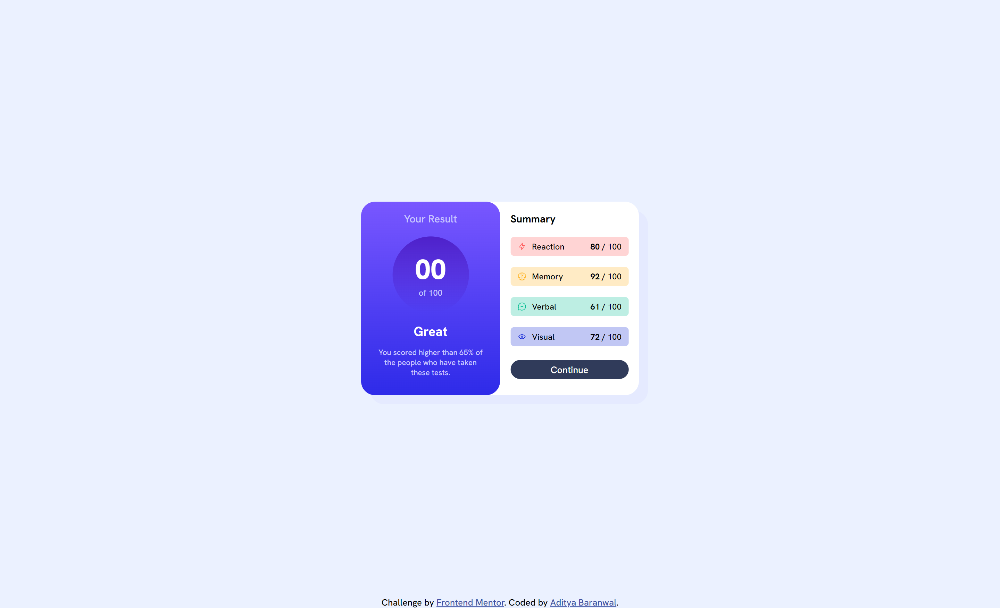

# Frontend Mentor - Results summary component solution

This is a solution to the [Results summary component challenge on Frontend Mentor](https://www.frontendmentor.io/challenges/results-summary-component-CE_K6s0maV). Frontend Mentor challenges help you improve your coding skills by building realistic projects. 

## Table of contents

- [Overview](#overview)
  - [The challenge](#the-challenge)
  - [Screenshot](#screenshot)
  - [Links](#links)
- [My process](#my-process)
  - [Built with](#built-with)
  - [What I learned](#what-i-learned)
  - [Continued development](#continued-development)
  - [Useful resources](#useful-resources)
- [Author](#author)
- [Acknowledgments](#acknowledgments)

**Note: Delete this note and update the table of contents based on what sections you keep.**

## Overview

### The challenge

Users should be able to:

- View the optimal layout for the interface depending on their device's screen size
- See hover and focus states for all interactive elements on the page

### Screenshot


.png)
.png)

### Links

- Solution URL: [Solution](https://github.com/CHARLIEADITYA/results-summary-component-main.git)
- Live Site URL: [View](https://charlieaditya.github.io/results-summary-component-main/)

## My process

### Built with

- Semantic HTML5 markup
- CSS custom properties
- Flexbox
- Mobile-first workflow
- [Styled Components](https://styled-components.com/) - For styles

### What I learned
I learned js and how to implement the data provided by server or user data or we can say that api fetch are easily handle by this code

To see how you can add code snippets, see below:

```js
var setData = "";
var result = 0;
var percentage = 0;
fetch("./assets/data/data.json")
  .then((res) => res.json())
  .then((data) => {
    for (let i = 0; i < data.length; i++) {
      setData += `
        <div class="empty b"  style="background-color:${data[i].bg_color} ; ">
          <div class="empty_content">
            
            <h1>${data[i].category}</h1>
          </div>
          <div>
            <p>${data[i].score} / <span>100</span> </p>
          </div>
        </div>
        `;

      result += data[i].score;
    }
    // console.log(Math.floor((result / (data.length * 100)) * 100));

    percentage = Math.floor((result / (data.length * 100)) * 100);
    document.querySelector(".data").innerHTML = setData;

    document.querySelector(".Btn").addEventListener("click", function () {
      //   document.querySelector(".result").innerHTML = percentage;
      // here we print counting 0 to 1 no.
      let counts = setInterval(() => {
        updated();
      }, 10);

      let number = 0;

      function updated() {
        document.querySelector(".result").innerHTML = ++number;
        if (number === percentage) {
          clearInterval(counts);
        }
      }
    });
  })
  .catch((err) => {
    console.log(err);
  });

```
## Author

- Github - [CHARLIEADITYA](https://github.com/CHARLIEADITYA)
- Frontend Mentor - [@CHARLIEADITYA](https://www.frontendmentor.io/profile/CHARLIEADITYA)
- Linkedin - [@adityabaranwal](https://www.linkedin.com/in/adityabaranwal34/)
